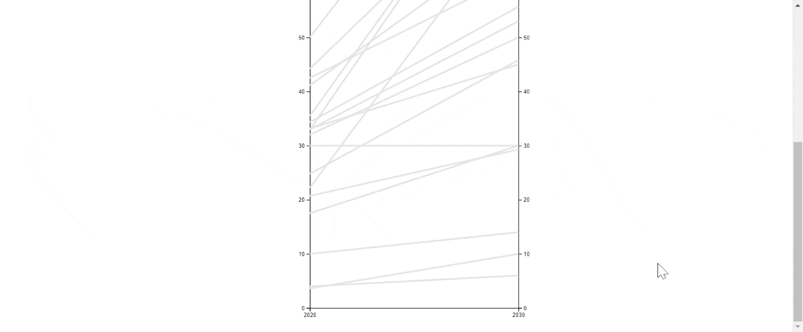

# energy_targets

To view the final visualization check out the following link:    
[https://paul-schultz.github.io/energy_targets/](https://paul-schultz.github.io/energy_targets/)

Creating this visualization was pretty simple I just made a bar chart in D3 with a range from 2020 to 2030. This was to create some consistency in the data because every city had a different start and end point. This may not lend to accuracy very well because renewable energy adoption isn't something that's going to increase  in a linear fashion. But this still does a lot to help see which cities are putting forth an effort and which are not over the next ten years. After importing the CSV data onto the D3 bar chart I added a second y-axis and some color coded hover effects with tooltips to get the exact starting point and target percentages. 
